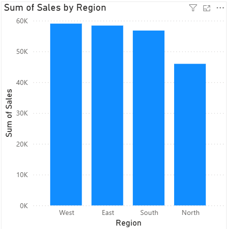
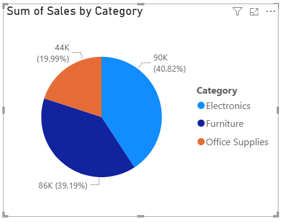
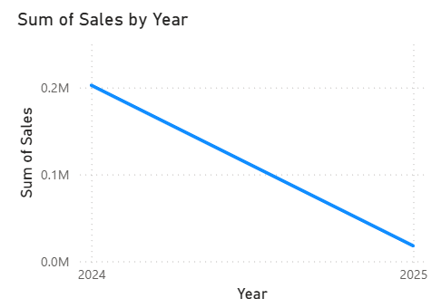
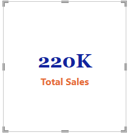
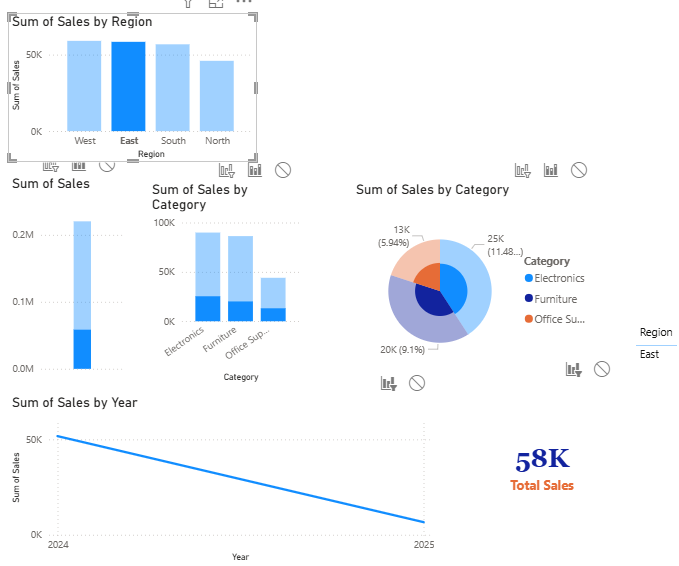
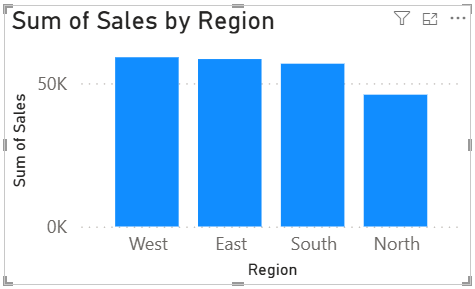

# Laboratory Work 1 — Power BI Basic Sales Data

**Student Name:** Edmundo C. Ederio Jr.
**File:** LW1_Basic_Sales_Data

---

## Part 1 & 2: Loading Data and Interface

### Data View Verification

#### 1. Default Data Types *(Before Correction)*
> Screenshots showing the data types as initially loaded by Power BI.

| Column | Screenshot |
|--------|-----------|
| Date |  |
| Product |  |
| Category |  |
| Region |  |
| Sales |  |

---

#### 2. Corrected Data Types *(After Manual Adjustment)*
> Screenshots showing the data types after manual verification and adjustment.

| Column | Status | Screenshot |
|--------|--------|-----------|
| Date | ✅ Unchanged |  |
| Product | ✅ Unchanged |  |
| Category | ✅ Unchanged |  |
| Region | ✅ Unchanged |  |
| Sales | 🔄 Changed to Decimal Number |  |

**Summary of Data Types:**
- **Date** — Formatted as `Date` datatype by default
- **Product, Category, Region** — Formatted as `Text` datatype by default
- **Sales** — Manually changed to `Decimal Number`

---

## Part 3: Creating Auto-Generated Visuals

### Step 1: Quick Visualization

| Question | Answer |
|----------|--------|
| What type of chart was created? | Power BI automatically created a **Clustered Column Chart** |
| What does it show? | It shows the total sum of sales across the entire dataset represented as a single bar |

---

### Step 2: Sales by Region Chart

| Question | Answer |
|----------|--------|
| Which region has the highest sales? | The **WEST** region has the highest sales bar |

---

### Step 3: Sales by Category

| Question | Answer |
|----------|--------|
| Which category dominates? | The **Electronics** category dominates with the largest slice |
| Is the distribution balanced? | **No.** Electronics takes up 40.82% while Office Supplies only takes up 19.99% |

---

### Step 4: Sales Over Time

| Question | Answer |
|----------|--------|
| Is there growth? | **No.** There is a clear negative growth trend. Sales decrease from approximately 0.20M in 2024 to around 0.02M in 2025, indicating a substantial year-over-year decline |
| Any noticeable trend? | Sales seem to decline significantly at the end of every quarter |

---

## Part 4: Basic Data Insight Interpretation

| Question | Answer |
|----------|--------|
| Which region contributes most revenue? | Based on the column chart, the **WEST Region** contributes the most revenue |
| Which product category performs best? | **Electronics** is the best performing category |
| Are sales consistent across dates? | **No.** Sales fluctuate — there are peaks in the middle of the month and dips at the start |
| What business recommendation can you suggest? | Since the WEST Region is performing well, we should investigate their marketing strategy and apply it to the lower-performing **NORTH Region** |

---

## Laboratory Questions

### Part A — Technical Questions

| # | Question | Answer |
|---|----------|--------|
| 1 | What are the five columns in the dataset? | Date, Product, Category, Region, Sales |
| 2 | What data type is assigned to the "Sales" column? | Decimal Number |
| 3 | Which Power BI view allows you to see raw data? | Data View |
| 4 | What chart type is best for showing trends over time? | Line Chart |
| 5 | What aggregation is automatically applied to Sales? | Sum (Summation) |

---

### Part B — Analytical Questions

| # | Question | Answer |
|---|----------|--------|
| 6 | Which region has the highest total sales? | The **West Region** |
| 7 | Which category has the lowest performance? | **Office Supplies** has the lowest performance |
| 8 | Are sales increasing, decreasing, or stable? | Sales are generally **decreasing** over the observed period |
| 9 | If you were a manager, which region would you prioritize? | The **North Region** — it has the lowest sales and needs intervention to meet targets |
| 10 | Provide one actionable recommendation based on the data. | Increase inventory for **Electronics**, as historical data shows massive demand for this category |

---

## Enhancement Section: Advanced Exploration

### Task 1: Card Visualization

| Question | Answer |
|----------|--------|
| What is the total sales amount? | **220,229** |

---

### Task 2: Slicer

| Question | Answer |
|----------|--------|
| What happens to other visuals when you click a region? | All other charts (Pie, Line, and Bar) change to show data **only** for the selected region |
| Why is filtering important in BI? | It allows users to focus on specific areas of interest (like one specific region) to find granular insights without being overwhelmed by the whole dataset |

---

### Task 3: Sort Sales

| Question | Answer |
|----------|--------|
| Does sorting improve readability? | **Yes** |
| Why? | It makes it instantly clear which region is performing best and which is worst, without having to visually compare unorganized bar heights |

---

### Task 4: Identify Outliers

| Question | Answer |
|----------|--------|
| Which region is significantly higher or lower? | The **North Region** is significantly lower compared to the others. While West (~59,041), East (~58,411), and South (~56,793) have relatively similar figures, North (~45,984) falls noticeably below this range — making it the clear lower outlier |
| What might explain that difference? | Lower sales in the North Region may be due to a smaller customer base, lower market penetration, reduced marketing efforts, stronger competition, or logistical and distribution challenges within that region |

---

*Laboratory Work 1 — Power BI | Edmundo C. Ederio Jr.*
