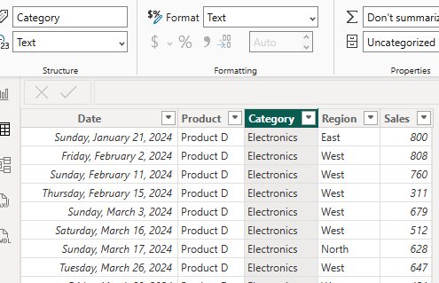
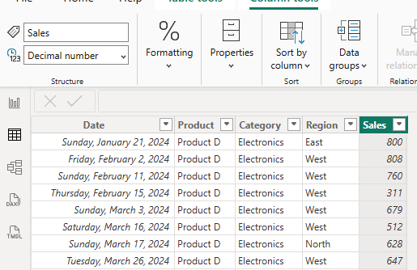

# Laboratory-Work1-Activity-PowerBI_v2-LW1_Basic_Sales_Data

### Student Name: Edmundo C. Ederio Jr

## Part 1 & 2: Loading Data and Interface

Data View Verification
1. Default Data Types (Before Correction) Sreenshot showing the data typews as initialy loaded by Power BI.

## DATE UNCHANGE
  
---
## PRODUCT UNCHANGE

---
## CATEGORY UNCHANGE

---
## REGION UNCHANGE

---
## SALES UNCHANGE
  
---
2. Corrected Data Types Screenshots showing the data types manual verification and adjustment.

## DATE UNCHANGE
  
---
## PRODUCT UNCHANGE

---
## CATEGORY UNCHANGE

---
## REGION UNCHANGE

---
## SALES CHANGE TO DECIMAL NUMBER
  
---

Date: Formatted as Date datatype by default.
Product/Sales/Category/Region/Date: All columns are visible.
Product/Category/Region: Formatted as Text datatype by default.

----

# Part 3: Creating Auto-Generated Visuals
---
## Step 1: Quick Visualization

Questions:

What type of chart was created?
  Answer: Power BI automatically created a Clustered Column Chart.
What does it show?
  Answer: It shows the total sum of sales across the entire dataset represented as a single bar.

## Step 2: Sales by Region Chart

